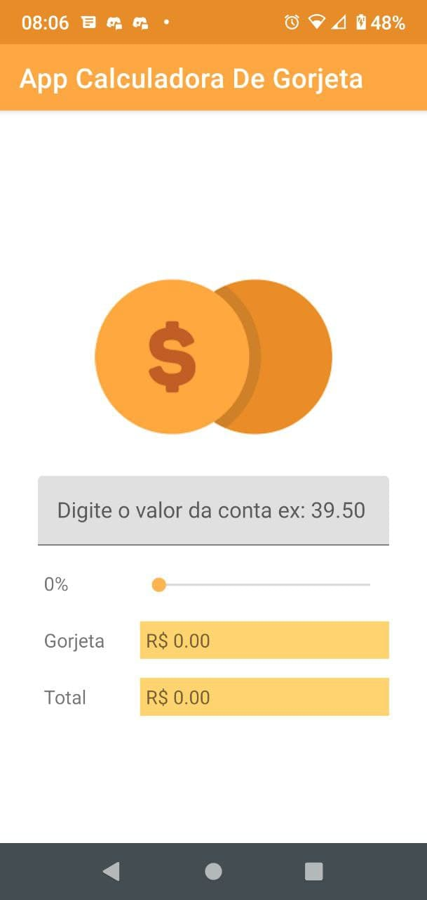
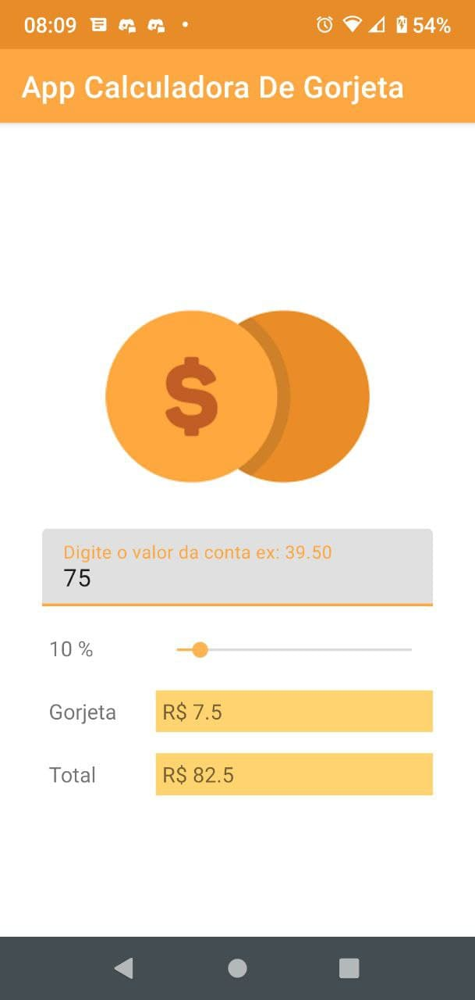
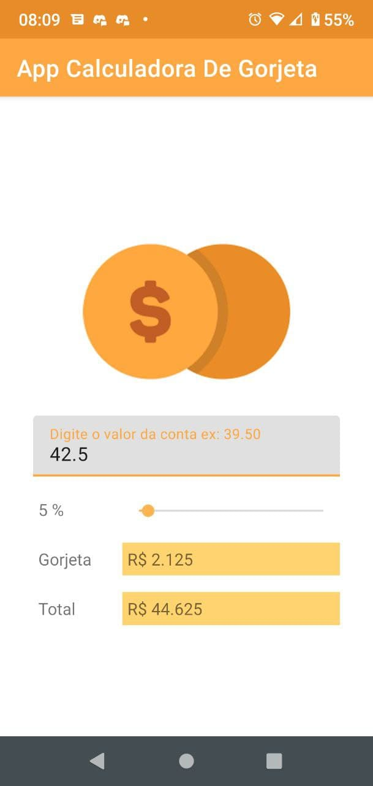

# App Calculadora De Gorgeta

## Table of contents

- [Introduction](#introduction)
- [Description](#Description)
- [Screenshots](#screenshots)
- [Technical info](#technical-info)

  [Languages](#languages)

- [Credits](#credits)
- [License](#license)

## Introduction

Use this app to calculate the total of your bill (bill + tip).

## Description

To calculate the total of your bill, enter the value of the bill and the slide the the bar to set the percentage of the tip you want to give. The total tip will be displayed, as well the total of the bill. You must enter the value of the bill first. If you don't, you'll get a warning telling you to do that.

## Screenshots

|                                    Demo 1                                    |                                    Demo 2                                    |
| :--------------------------------------------------------------------------: | :--------------------------------------------------------------------------: |
|  |  |

|                                                  Warning                                                  |     |
| :-------------------------------------------------------------------------------------------------------: | :-: |
|  |     |

## Technical info

### Languages

 

# Credits

This app is one of the projects developed in the online course **Desenvolvimento Android Completo 2021 - Crie 18 Apps**, available at [Udemy](https://www.udemy.com/course/curso-de-desenvolvimento-android-oreo/).

## License

